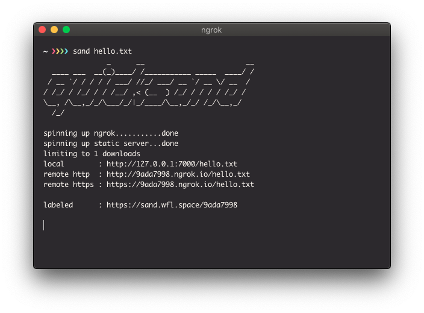

# quicksand



## Usage

I symlink the `quicksand` binary to someplace in my `PATH` as `sand`. In this document, any time I use the command `sand`, that is what I'll be referring to.

```sh-session
$ sand hello.txt
starting...
listening at http://127.0.0.1:7000
http: http://xxxxxxxx.ngrok.io
```

By default, only 1 download is allowed, as the primary purpose of this program is to send 1 file 1 time. A command line option is provided to change this.

## Contributing

1. Fork it ( https://github.com/willamin/quicksand/fork )
2. Create your feature branch (git checkout -b my-new-feature)
3. Commit your changes (git commit -am 'Add some feature')
4. Push to the branch (git push origin my-new-feature)
5. Create a new Pull Request

## Contributors

- [willamin](https://github.com/willamin) Will Lewis - creator, maintainer
